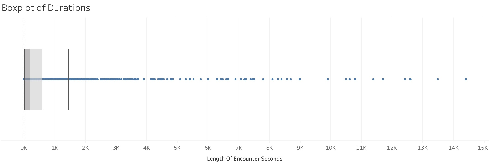

# UFO Sighting Data Analysis Project

**Exploring temporal, geographic, and descriptive patterns in UFO sighting reports from the early 1900s until present using Python and Tableau.**

## Table of Contents

- [Project Overview](#project-overview)  
- [Dataset](#dataset)  
- [Objectives](#objectives)  
- [Tools & Technologies](#tools--technologies)  
- [Data Cleaning & Transformation](#data-cleaning--transformation)  
- [Exploratory Data Analysis & Visualization](#exploratory-data-analysis--visualization)  
- [Key Insights](#key-insights)  

## Project Overview

This project analyzes a historical dataset of UFO sightings. The goal is to discover patterns in sighting counts over time, geographic locations such as city or state, common UFO shapes, encounter durations, and sentiment expressed in witness descriptions, for reports across the United States and Canada. The project demonstrates my ability to use python for data cleaning and sentiment analysis, as well as my skills in Tableau to build interactive dashboards for visualization.

## Dataset

- Source: Publicly available UFO sightings dataset ([Kaggle: UFO Sightings around the world](https://www.kaggle.com/datasets/camnugent/ufo-sightings-around-the-world/data))

- Size: Over 16,000+ records spanning multiple decades from the early 1900s to present
- Columns:  
  - `Date_time`: Date and time of sighting  
  - `city`, `state/province`, `country`: Location details  
  - `UFO_shape`: Reported shape of the UFO  
  - `length_of_encounter_seconds`: Encounter duration in seconds  
  - `description`: Witness narrative
  - `date_documented`: Date sighting was documented  
  - `latitude`, `longitude`: Geographic coordinates  

The dataset contains missing values and possibly inaccurate data; extensive cleaning was needed.

## Objectives

- Analyze temporal trends of UFO sightings (By Year, Month, Day of Week, etc).
- Recognize Sighting Hotspots and Locations
- Identify the popular UFO shapes and how their distributions change over time.
- Examine relationship between encounter duration and other variables.
- Perform sentiment analysis on witness descriptions.

## Tools & Technologies

- Python (including libraries such as pandas, numpy, re, matplotlib, vaderSentiment, etc.) for data cleaning and sentimental analysis
- Tableau for interactive data visualization
- Jupyter Notebook for exploratory analysis

## Data Cleaning & Transformation

- Key steps of cleaning:
- Checking for duplicates, formating Column Names and drop columns not needed
- Extracting key information from Date_Time to add time related columns such as Year, Month, Hour, and Season.
- Checking for illogical values in columns and clipping them to a certain max/min.
- Converting Columns to their correct data types (e.g. numeric, DateTime, etc)
- Using REGEX to clean out special symbols embedded in the values.  
 
- **See cleaning_ufo_sighting.ipynb file for detailed operations**

## Exploratory Data Analysis & Visualization

- You can also find the dashboard uploaded onto tableau public for the below screenshots:
([Tabeau Public: UFO Sighting Data Analysis](https://public.tableau.com/app/profile/brisson.lam/viz/ufo_sighting_data/Duration_Analysis))

### Geographical Analysis
- Geographical Distribution of sightings align with human habitation, as seen with clusters in the east and west coast, but scarcity in the midwest.
- Top States/Provinces with most sightings are California, Washington, Florida, and Texas (All heavy populated states).
- Top Cities with most sightings are Seattle, Phonenix, Portland, and Las Vegas.

### Temporal Analysis
- A steady increase in sightings from 1940 to the 1990s, with a sudden exponential growth after the mid 1990s.
- Sightings peak during summer months, especially July, as well as weekends, especially Saturday and Sunday.
- It is more likely to see an UFO at night, when it is dark. This coincides with the fact that spike in sightings peak in later hours during summer, when it gets dark later.
- Warmer seasons also aligns with more sightings (Summer > Spring ~ Autumn > Winter).

### Shape Analysis
- Looking at the shape distributions over time, we see that prior to the 1980s, dominant UFO shape sighted was "disk", but since then was overtaken by "light". 
- Overall the most common shape is "light", with over 24% of all sightings all falling into this shape category.

### Most Common Shapes Across States/Provinces
- A overwhelming majority of states report seeing Light-shaped UFOs as the most common shape, further confirming this as the prevailing shape in sightings across regions.
- A few exceptions include Triangle in North Dakota and Sphere in Yukon Territory, hinting of slight regional variations.

### Duration Analysis
- Looking at th boxplot of Durations, we still find a lot of values to the skewing the distribution (There are illogical values that claim of Sightings that last for hours and hours!). To get a good calculation of mean, we clip the extreme outliers (Top 25%).

- To do this, we create the following calculated field in Tableau:

- The UFO shapes that have the longest average sightings (in seconds) are "Changing" and "Cone", while the shortest ones tend to be "Flash" and "Flare".
- There seems to be no pattern of duration variation over the years, or by the time of day or season.

- There seems to be no visible pattern of duration variation geographically as well.

## Sentiment Analysis for Witness Description

**See sentiment_analysis.ipynb file for detailed operations**  
- Cleaning is done first for the description column
    * remove meaningless symbols and words that do not convey meaning
    * normalize white space
    * remove numbers and symbols enmbeded within words

### Generate Word Cloud
- Generate a word cloud to see the most common words appearing in the description column.
- The most common words seems to be "saw", "sky", "white light", "light", "UFO", etc.

### Most Positive and Negative Descriptions
- We then use the Vader Sentiment Library in python to generate a sentiment polarity score for each row in the description column.
- Most positive = 1.00, Most Negative = -1.00, Neutral = 0.00

- We can take a look at some of the most positively rated descriptions:
    * "visiting friends lawton everyone had gone bed sitting backyard relaxing enjoying clear warm night" (score=0.9217)
    * "beautiful night clear skies wonderful light show hope see more future" (score=0.9201)
- And the most negatively rated descriptions:
    * "Seeing believing but it scary as hell" (score=-0.8955)
    * "this so crazy felt as if we where about be attacked if not being study perfect attack" (score=-0.9136)

### KDE Distribution of Sentiment Scores

- Plotting a Kernel Density Estimate of Sentiment scores, we can see the approximate distuibution of Sentiment Scores. It seems that the tallest peak is at 0, indicating most descriptions are quite neutral.

- We then classify the scores into disdtinct categories of Positive, Neutral, and Negative, and plot a pie chart to see their percentages:
- Scores above 0.05 are considered positive sentiment. Scores below -0.05 are negative. Scores between -0.05 and 0.05 are neutral. (Boundaries come from the original VADER paper; it is a good balance to minmize the chance of having too many neutral classifications while still effectively capturing sentiment.)

- It seems that over half (~55%) of all descriptions are classified as Neutral, while 30% of the the descriptions are classified as Positve, and around 15% of them are classified as Negative.

## Key Takeaways  

### Temporal
- You are most likely to see an UFO on a weekend night (especially Saturday) during summer, particularly July and August.
- More sightings on weekends and later hours in summer suggest correlation with human outdoor activity.
- During the mid 1990s, an inflection point is observed for UFO sightings, starting an exponential growth in sightings after long decades of steady growth.
- Increased UFO sightings since this period might have likely stemmed from a combination of factors: greater public access to the internet and media coverage popularizing UFO phenomena (ex. the X-files TV shows debuted in 1993), alongside geopolitical shifts post-Cold War that sparked curiosity and speculation, all contributing to more widespread reporting and awareness.
 

### Geographical
- Geographical Distribution of sightings align with human habitation, as seen with clusters in the east and west coast, but scarcity in the midwest, indicating that population density strongly influences sighting frequency.
- Certain states, such as Texas and California, reported the highest number of sightings; this is likely due to their large populations, extensive urban and rural areas, and possibly greater media coverage or cultural interest in UFO phenomena.
- The prevalence of "Light" as the most observed shape across most states and provinces suggests that many sightings involve luminous or glowing objects, which may be easier to notice and report than specific shapes, especially during nighttime or in low-visibility conditions. It may also be the case that some individuals might mistaken man-made glowing objects (airplanes, hot air balloons) as UFOs.
 

### Shape
- The most common UFO shapes reported were "Triangle", "Light", and "unknown". They make up almost half the shapes of UFO sighted.
- The dominant UFO Shape sighted has changed from "Disk" during the 1940s - 1980s, to "Light" since the 1990s. This might be due to a shift in cultural influences and media portrayal affecting witness descriptions. 
- The "classic flying saucer" (disk) was iconic during the 1940s-80s due to early sci-fi and reported incidents. But with the rise of the internet and social media since the 1990s, certain UFO narratives (e.g., mysterious lights, orbs) have become more widespread, influencing new reports.
 

### Durational
- "Changing" shaped sightings tended to have longer encounter durations on average, while "flash" shaped tend to last shorter. This coincides with their names: "changing" shaped will shift their shapes, lasting longer in the sky, while "flash" shaped will just sparkle in the sky and be gone.
- It is hard to see a relationship between sighting duration with other temporal or geographical variables, indicating they may have no correlation.  
 

### Sentimental
- Sentiment analysis revealed that most witness descriptions (around 55%) were neutral, reflecting that people used factual reporting rather than emotional language. 
- This may be because for some, UFO sightings might be integrated into their worldview as a non-threatening event, leading to a calm, factual reporting. Or it may be due to them trying to avoid disbelief from others, to downplay emotional reactions in order to be taken seriously when reporting to authorities or media.

